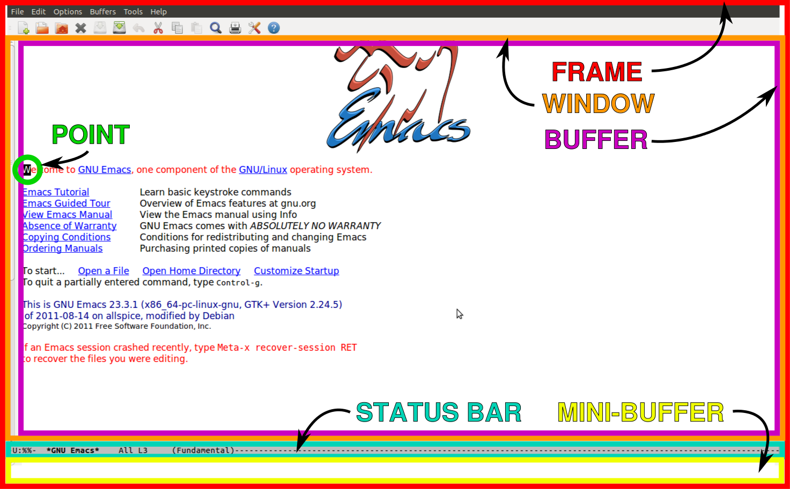

# emacs 101

TL;DR - Start here. A quick understanding of emacs' whats and hows.

### Visual Breakdown

Credits: Jess Hamrick. [Source](http://www.jesshamrick.com/2012/09/10/absolute-beginners-guide-to-emacs/)

### Concepts of visual editor

  * Frame
    * Instance of running emacs is called a frame.

  * Window
    * emacs by default shows a single window. Can have multiple buffers within.

  * Buffer
    * display file contents, terminal windows etc.
    * emacs also opens a **Message** buffer to log details and show error(s) if any.
    * emacs also opens a **scratch** buffer to write notes and other things which you may wish to catalog in but not necessarily save.

  In the footer area:

  * Status Bar
    * namesake, displays info about the point and the active buffer.

  * Mini-Buffer
    * displays status messages and place to enter emacs commands. You'll see the commands as you type them.

  And of course the cursor in emacs can also be referred to as `point`.
